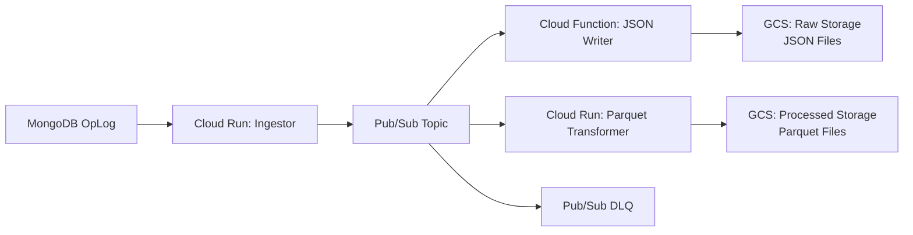

# Fluffy Garbanzo - MongoDB Change Data Capture Pipeline

A production-ready, bifurcated data pipeline on Google Cloud Platform that captures MongoDB change streams in real-time and processes them through parallel paths for both raw storage and analytical processing.

## Overview

This project implements a **bifurcated kappa architecture** that ingests MongoDB change events and processes them simultaneously through two parallel streams:

- **Raw Path**: Stores original JSON documents for compliance and debugging
- **Analytics Path**: Transforms data into optimized Parquet format for analytical workloads

The system is designed for high throughput, fault tolerance, and schema evolution, making it suitable for production data engineering workflows.

## Architecture



### Pipeline Flow

```
MongoDB Change Stream → Cloud Run Ingestor → Pub/Sub Topic → ┌─ Cloud Function → GCS Raw (JSON)
                                                            └─ Cloud Run Transformer → GCS Processed (Parquet)
                                                                        ↓
                                                            Dead Letter Queue (DLQ)
```

## Core Components

### 1. **MongoDB Ingestor** (`cloud-run-ingestor/`)
- **Purpose**: Listens to MongoDB change streams and publishes events to Pub/Sub
- **Technology**: Cloud Run service with Flask
- **Features**:
  - Real-time change stream processing
  - Automatic reconnection handling
  - CloudEvents format publishing
  - Health monitoring endpoints

### 2. **Pub/Sub Messaging Layer**
- **Primary Topic**: `mongo-change-stream-topic` - Main event distribution
- **Dead Letter Queue**: `mongo-change-events-dlq` - Failed message handling
- **Features**:
  - Message retention and durability
  - Automatic retry with exponential backoff
  - Poison message isolation

### 3. **Raw JSON Writer** (`cloud-function-writer/`)
- **Purpose**: Persists original change events as JSON files
- **Technology**: Cloud Function (2nd gen)
- **Output**: `gs://{bucket}/raw/{collection}/date={YYYY-MM-DD}/`
- **Features**:
  - Preserves original document structure
  - Date-partitioned storage
  - BSON type preservation

### 4. **Parquet Transformer** (`cloud-run-transformer/`)
- **Purpose**: Schema-aware transformation to columnar format
- **Technology**: Cloud Run service with pandas/PyArrow
- **Output**: `gs://{bucket}/processed/{collection}/date={YYYY-MM-DD}/`
- **Features**:
  - Declarative schema mappings
  - Field transformations and validation
  - Anti-hotspotting with random prefixes
  - Support for multiple collections

## Data Processing Features

### Schema Management
- **Configurable Schemas**: Collection-specific PyArrow schemas in `config/schema_mappings.py`
- **Field Mappings**: Declarative transformations in `config/transformer.py`
- **Validation**: Runtime schema validation with detailed error reporting
- **Evolution**: Graceful handling of schema changes

### Storage Organization
```
# Raw Storage (JSON)
gs://bucket/raw/customers/random_prefix-2024-01-15/operation_timestamp_uuid.json

# Processed Storage (Parquet)  
gs://bucket/processed/customers/random_prefix-2024-01-15/operation_timestamp_uuid.parquet

# Debug Storage (JSON) - From Cloud Function
gs://bucket/debugging/customers/random_prefix-2024-01-15/timestamp_uuid_event.json
gs://bucket/debugging/customers/random_prefix-2024-01-15/timestamp_uuid_decoded.json
```

### Operation Support
- **Insert**: New document creation
- **Update**: Document modifications with before/after snapshots
- **Delete**: Document removal events
- **Replace**: Full document replacement

## Deployment

The project includes comprehensive deployment scripts organized by phases:

### Phase 3: MongoDB Ingestor
```bash
./scripts/phase-3-deploy-app.sh
```
- Deploys Cloud Run ingestor service
- Configures container registry
- Sets up service accounts

### Phase 4: JSON Writer
```bash
./scripts/phase-4-deploy-cloud-function.sh
```
- Deploys Cloud Function
- Creates Pub/Sub trigger
- Configures GCS permissions

### Phase 5: Parquet Transformer
```bash
./scripts/phase-5-deploy-cloud-run-transformer.sh
```
- Deploys Cloud Run transformer
- Creates EventArc trigger
- Sets up parallel processing

## Configuration

All deployment configuration is centralized in `scripts/config.sh`:

```bash
# Core Project Settings
export PROJECT_ID="your-gcp-project"
export REGION="europe-west1"
export BILLING_ACCOUNT_ID="your-billing-account"

# Storage Configuration
export GCS_RAW_BUCKET_NAME="your-raw-bucket"
export GCS_PROCESSED_BUCKET_NAME="your-processed-bucket"

# Service Configuration
export CLOUD_RUN_INGESTOR_NAME="mongo-ingestor-v2"
export CLOUD_RUN_TRANSFORMER_NAME="parquet-transformer-v1"
export CLOUD_FUNCTION_NAME="mongo-data-writer"

# Messaging Configuration
export PUBSUB_TOPIC_NAME="mongo-change-stream-topic"
export PUBSUB_DLQ_NAME="mongo-change-events-dlq"
```

## Monitoring and Operations

### Health Checks
- **Ingestor**: `GET /health` - Service status and MongoDB connectivity
- **Transformer**: `GET /health` - Schema availability and GCS connectivity
- **Debug Info**: `GET /debug` - Configuration and runtime diagnostics

### Logging
```bash
# Monitor ingestor logs
gcloud logs tail --resource.labels.service_name=mongo-ingestor-v2

# Monitor transformer logs
gcloud logs tail --resource.labels.service_name=parquet-transformer-v1

# Monitor function logs
gcloud logs tail --resource.type=cloud_function --resource.labels.function_name=mongo-data-writer
```

### Metrics and Alerting
- Message processing rates
- Transformation success/failure rates
- Storage usage and costs
- Schema validation failures

## Schema Configuration

### Adding New Collections

1. **Define Schema** in `cloud-run-transformer/schema.py`:
```python
def get_orders_schema():
    return pa.schema([
        pa.field('order_id', pa.string(), nullable=False),
        pa.field('customer_id', pa.string(), nullable=True),
        pa.field('amount', pa.decimal128(10, 2), nullable=True),
        pa.field('created_at', pa.timestamp('ns'), nullable=True)
    ])
```

2. **Configure Mappings** in `cloud-run-transformer/mappings.py`:
```python
def get_orders_mappings():
    return {
        'order_id': FieldMapping('_id', str),
        'customer_id': FieldMapping('customerId', str),
        'amount': FieldMapping('total.amount', decimal.Decimal),
        'created_at': FieldMapping('createdAt', 'timestamp')
    }
```

3. **Update Registry** in `cloud-run-transformer/config/schema_mappings.py`:
```python
COLLECTION_REGISTRY['orders'] = {
    'schema_func': get_orders_schema,
    'mapping_func': get_orders_mappings
}
```